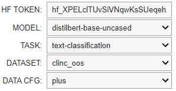

# Model Craft: Fine-Tuning and Distillation of LLM Models

Model Craft is a toolkit for fine-tuning and distilling Large Language Models (LLMs) with ease. This project allows AI researchers and enthusiasts to craft their own LLMs and push them to Hugging Face's model hub.

## Quick Start

You only need to launch it, select the model, select the dataset and hit the button ✅

### Prerequisites

- Google Colab account
- Hugging Face account

### Usage

Open new google colab notebook.

Make sure your runtime is on GPU (ex. T4 GPU) 

1. **Install Dependencies**
   
   ```bash
   %%capture
   !pip install datasets transformers evaluate accelerate 

2. **Clone the Repository and make it global**
   
   ```bash
   %%capture
   !git clone https://github.com/nikitakapitan/modelcraft.git
   %cd modelcraft
   !pip install .


3. **Configuration Setup**
Import the config widget and customize it as you want

   ```bash
   from modelcraft.vizual.colab_widget import config_yaml
   config_yaml() 

<p align="center">
  
</p>

(!) WORK_IN_PROGRESS: Add custom model & dataaset name

## Fine-Tuning Your Model

Once you have configured your settings, use this comamand to fine-tune:

  ```bash
  !python modelcraft/finetune.py --config finetune.yaml
  ```

The model will be automatically pushed to your Hugging Face account.

## Distill Your Model

(!) WORK_IN_PROGRESS: Adjust widget for Distillation

Once you have configured your settings, use this comamand to fine-tune:

  ```bash
  !python modelcraft/distill.py --config distill.yaml
  ```

The model will be automatically pushed to your Hugging Face account.

## Contributing
We welcome contributions! If you'd like to improve or add features to NLP Hub, please feel free to submit a pull request.
