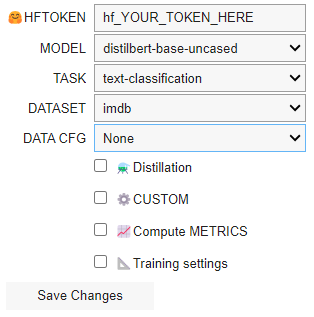

# Model Craft: Fine-Tuning and Distillation of LLM Models

Model Craft is a toolkit for fine-tuning and distilling Large Language Models (LLMs) with ease. This project allows AI researchers and enthusiasts to craft their own LLMs and push them to Hugging Face's model hub.

## Quick Start

You only need to launch it, select the model, select the dataset and hit the button ✅

### Prerequisites

- Google Colab account
- Hugging Face account

### Usage

Open new google colab notebook.

Make sure your runtime is on GPU (ex. T4 GPU) 

## 1. **Install Dependencies**
   
   ```bash
   %%capture
   !pip install datasets transformers evaluate accelerate 
   ```

## 2. **Clone the Repository and make it global**
   
   ```bash
   %%capture
   !git clone https://github.com/nikitakapitan/modelcraft.git
   %cd modelcraft
   !pip install .
```


## 3. Customize your config


Import the finetune widget and customize it.

   ```bash
   from modelcraft import widget
   widget()
```

<p align="center">
  
</p>

## 4. Run the job:

### Finetune Your Model

  ```bash
  !python modelcraft/finetune.py --config config.yaml
  ```

### Distill Your Model
  ```bash
  !python modelcraft/distill.py --config config.yaml
  ```

Done ✅ Your new model is automatically pushed to your Hugging Face account 🤗

## Contributing
We welcome contributions! If you'd like to improve or add features to Model Craft, please feel free to submit a pull request.
